# 📦 Transp Lojistik - Smart Cargo & Dynamic Management System

Transp Lojistik; modern web teknolojileri, esnek NoSQL veri tabanı mimarisi ve kullanıcı deneyimi (UX) odaklı arayüz bileşenleri kullanılarak geliştirilmiş, uçtan uca dinamik bir lojistik yönetim ve anlık kargo takip platformudur. 

Proje, static frontend şablonlarının .NET mimarisiyle dinamikleştirilmesi ve gelişmiş bir Admin Paneli (Silva Admin) üzerinden yönetilmesini kapsar.

---

## 🎯 Projenin Amacı & NoSQL Geçiş Deneyimi

Bu proje, kariyerim boyunca ve geliştirdiğim yazılımlarda ağırlıklı olarak kullandığım İlişkisel Veri Tabanı (RDBMS/MSSQL) mimarisinin dışına çıkarak, ilk defa NoSQL (MongoDB) teknolojisini deneyimlemek amacıyla geliştirilmiş, tamamen öğrenme ve pratik kazanma odaklı bir çalışmadır.

Buradaki temel motivasyon, mevcut SQL yetkinliklerimin yanına farklı bir veri tabanı paradigmasını da ekleyerek mühendislik vizyonumu genişletmektir. İlişkisel model dışında esnek veri yapılarının nasıl çalıştığını uygulamalı olarak kavramak, deneyim kazanmak ve gelecekte ihtiyaç duyulması halinde bu teknolojiyi de projelerimde bir alternatif olarak güvenle konumlandırabilmek adına hayata geçirilmiştir.
### 💡 Bu Süreçte Ne Öğrendim?
* **Masa Tasarımından Doküman Tasarımına:** Tabloları `Primary Key` / `Foreign Key` ile bağlamak yerine, MongoDB'nin gücünden yararlanarak kargo hareketlerini ana dökümana nasıl gömeceğimi (`Embedded Documents/Arrays`) deneyimledim.
* **Esnek Şema (Schema-less) Yönetimi:** Katı veri kuralları yerine, lojistik süreçlerinde değişebilen dinamik veri yapılarını NoSQL üzerinde esnekçe yönetmeyi öğrendim.
* **BSON/JSON Mapping:** .NET ortamında MongoDB C# Driver kullanarak DTO'lar ve gerçek NoSQL dökümanları arasındaki veri eşlemelerini (mapping) gerçekleştirdim.

---

## 🚀 Öne Çıkan Özellikler & Modüller

### 1. Kullanıcı Tarafı (Public UI)
* **Gelişmiş Kargo Takip Sistemi (Real-Time Tracking):** Kullanıcılar kargo takip numaralarını girerek gönderinin anlık durumunu, konumunu ve geçmiş tüm hareketlerini kronolojik bir zaman çizelgesi (Timeline) ve durum ilerleme çubuğu (Progress Bar) üzerinden anlık takip edebilir.
* **Canlı Nakliye Maliyeti Hesaplama (UUX/UI Optimize):** JavaScript (ES6) tabanlı çalışan bu araç; seçilen hizmet türü (Kurye, Parsiyel, Komple, Evden Eve), ağırlık, adet ve ek hizmetlere (ekspres, sigorta, paketleme) göre tahmini maliyeti kullanıcı input girdikçe **anlık ve canlı** hesaplar. Gereksiz form elementleri arındırılarak maksimum dönüşüm (conversion) hedeflenmiştir.
* **Tamamen Dinamik ViewComponent Altyapısı:** Ana sayfadaki `Hizmetlerimiz`, `Neler Yaptık (Projeler)`, `Müşteri Yorumları` ve `Sıkça Sorulan Sorular (Accordion)` gibi tüm alanlar veri tabanına bağlıdır.

### 2. Yönetim Paneli
* **Arındırılmış Topbar & Sidebar:** Admin paneli üst barındaki tüm kalabalık (search, gereksiz bildirimler, profil dropdownları) temizlenerek sadece kurumsal logo ve sade bir karşılama metni bırakılmıştır.
* **Modüler İçerik Yönetimi:** Ana sayfadaki slider içerikleri, süreç adımları ("Nasıl Çalışır"), sıkça sorulan sorular ve müşteri yorumları tamamen dinamik olarak eklenebilir, silinebilir ve güncellenebilir.
* **Kargo & Hareket Yönetimi:** Her kargo kaydına bağlı olarak MongoDB alt dökümanlarında (`Subdocuments`) kargo hareketleri (zaman, lokasyon, açıklama) eklenebilmekte ve güncellenebilmektedir.

---

## 📸 Ekran Görüntüleri (Arayüz)

### 🏠 Ana Sayfa (Public UI)
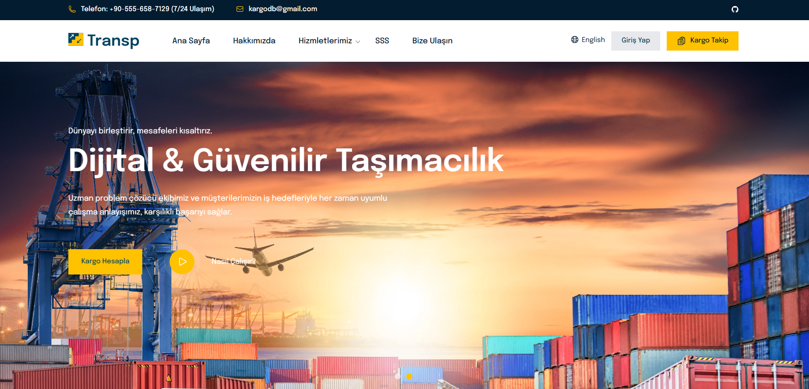
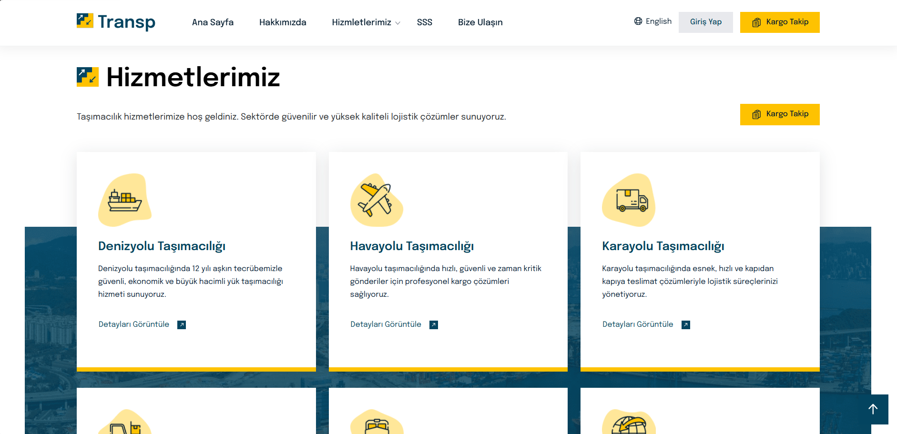
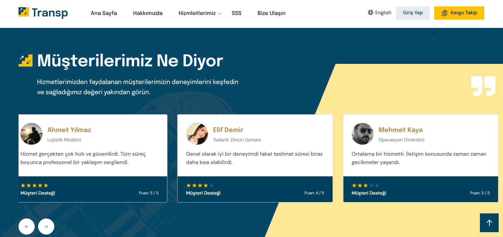
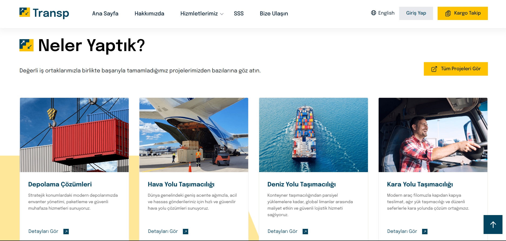
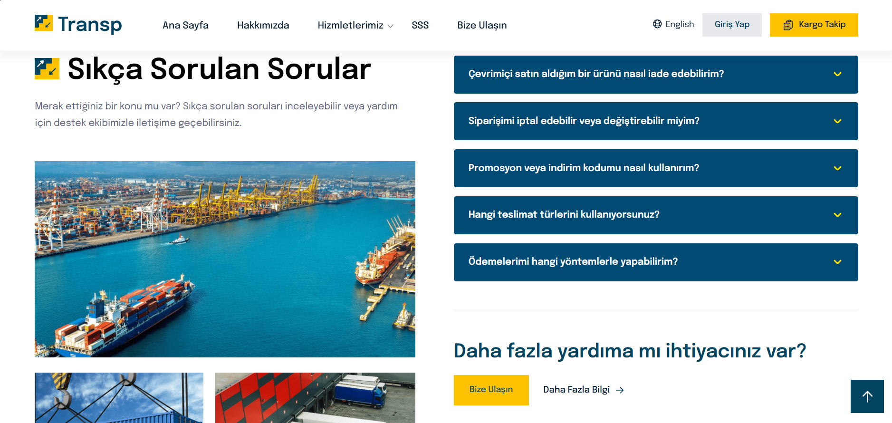
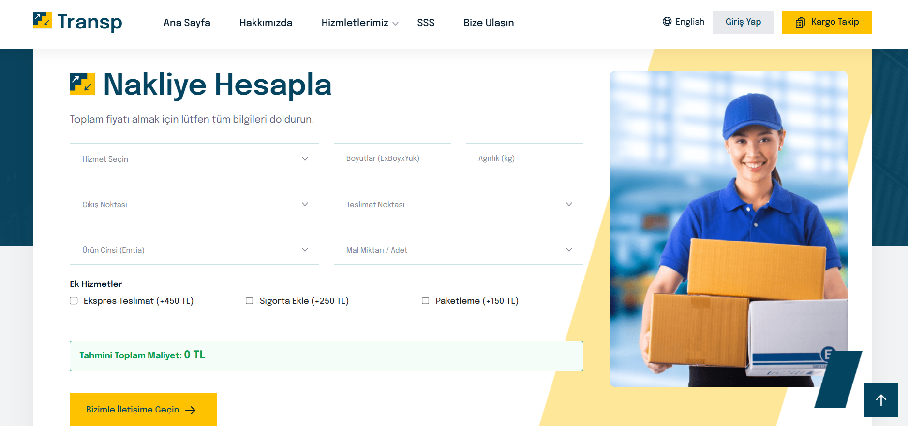

### 📦 Kargo Takip Ekranları
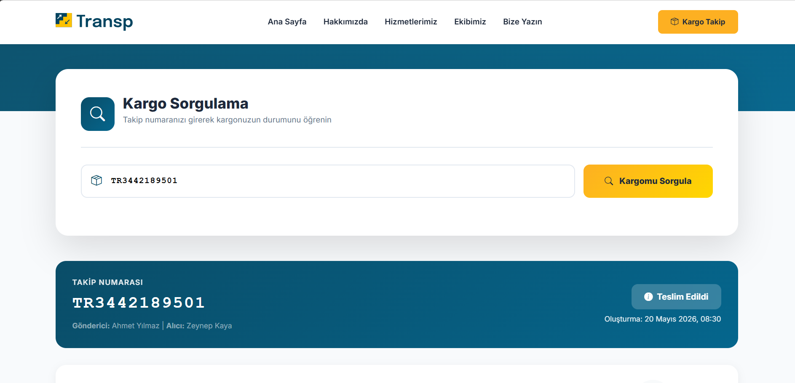
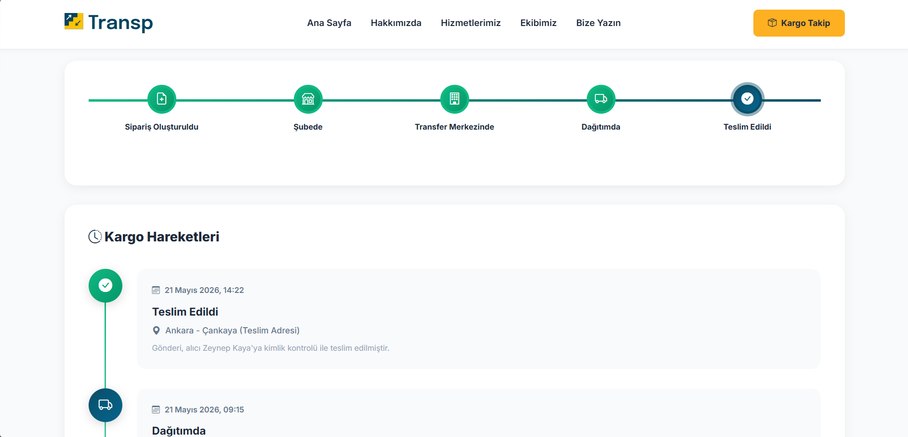
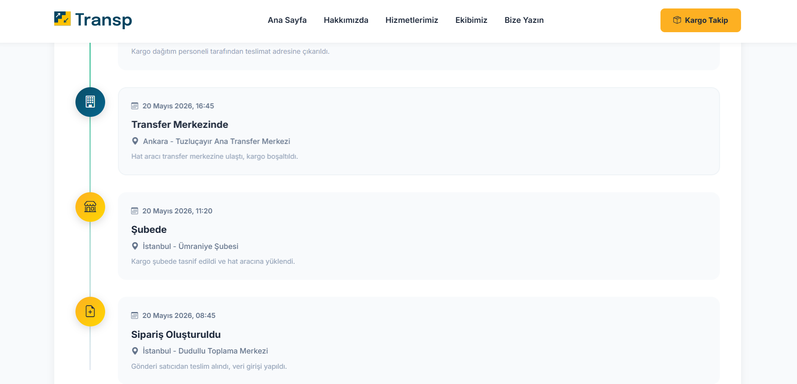

### 👨‍💻 Yönetim Paneli
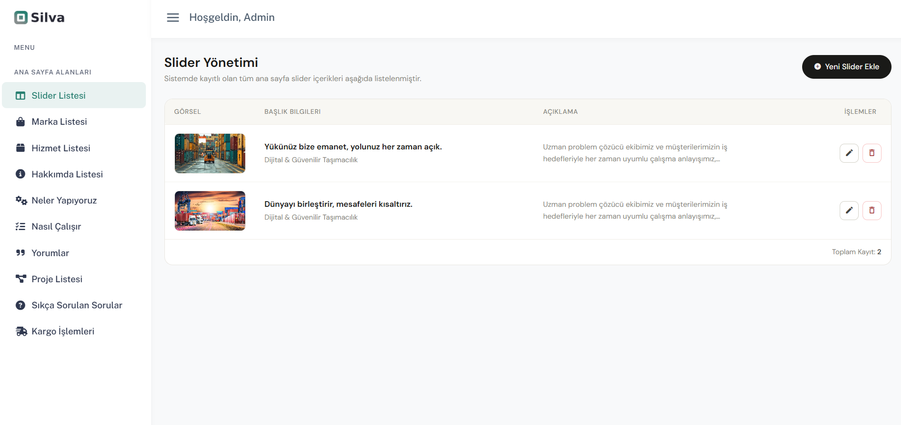
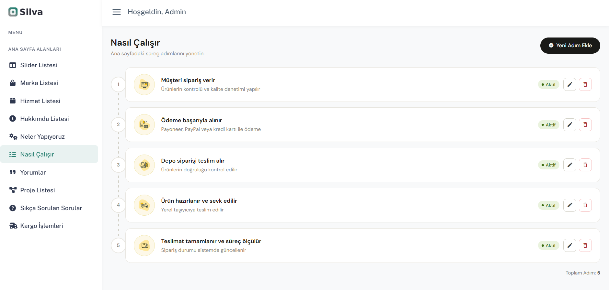
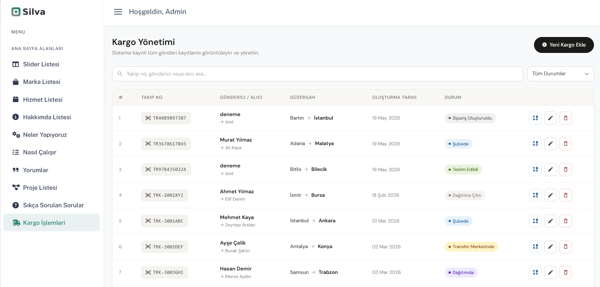
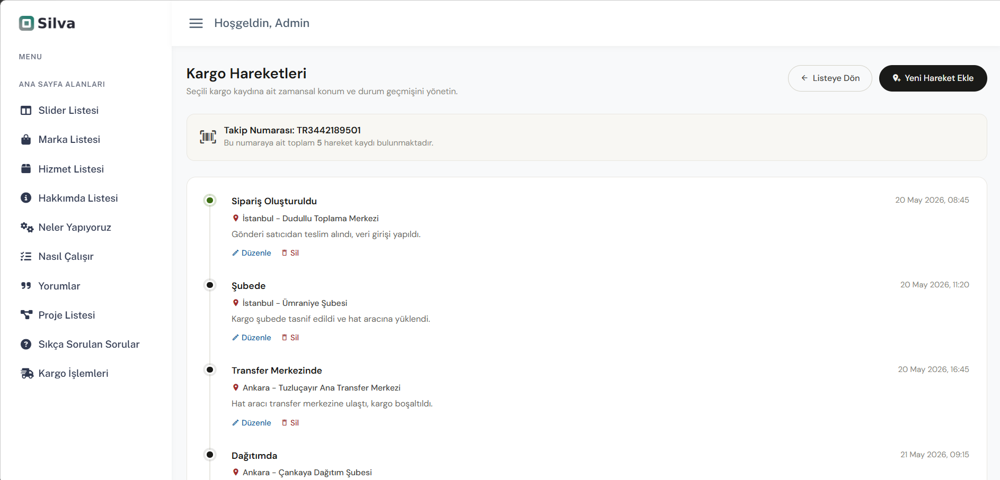
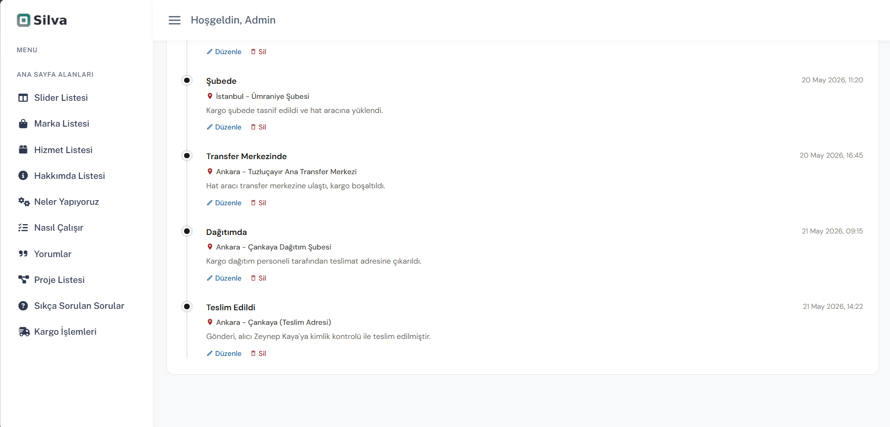

---

## 🛠️ Kullanılan Teknolojiler

* **Backend:** .NET 8.0 / ASP.NET Core MVC
* **Veri Tabanı:** MongoDB (NoSQL mimarisi, gömülü doküman/array yönetimi)
* **Frontend:** Bootstrap 5, HTML5, CSS3 (Custom Responsive Layouts), JavaScript (ES6+), Bootstrap Icons, Feather Icons
* **Tasarım Standartları:** Repository Pattern, Dependency Injection, ViewComponents, DTO (Data Transfer Objects), BSON Mapping

---

## 📁 Örnek MongoDB Doküman Yapısı (BSON/JSON)

Kargo hareketleri ve durum geçmişi, MongoDB'nin doküman tabanlı gücünden yararlanılarak ana gönderi dökümanı içerisinde gömülü bir dizi (`Trackings Array`) olarak performanslı bir şekilde saklanmaktadır:

```json
{
  "_id": "6a0db155fe104bbea2261423",
  "TrackingNumber": "TR3442189501",
  "SenderName": "Ahmet Yılmaz",
  "ReceiverName": "Zeynep Kaya",
  "OriginCity": "İstanbul",
  "DestinationCity": "Ankara",
  "CreatedDate": "2026-05-20T08:30:00.000+00:00",
  "CurrentStatus": "Teslim Edildi",
  "Trackings": [
    {
      "EventDate": "2026-05-20T08:45:12.124+00:00",
      "Location": "İstanbul - Dudullu Toplama Merkezi",
      "Description": "Gönderi satıcıdan teslim alındı, veri girişi yapıldı.",
      "TrackingStatus": "Sipariş Oluşturuldu"
    },
    {
      "EventDate": "2026-05-21T14:22:45.612+00:00",
      "Location": "Ankara - Çankaya (Teslim Adresi)",
      "Description": "Gönderi, alıcı Zeynep Kaya'ya kimlik kontrolü ile teslim edilmiştir.",
      "TrackingStatus": "Teslim Edildi"
    }
  ]
}